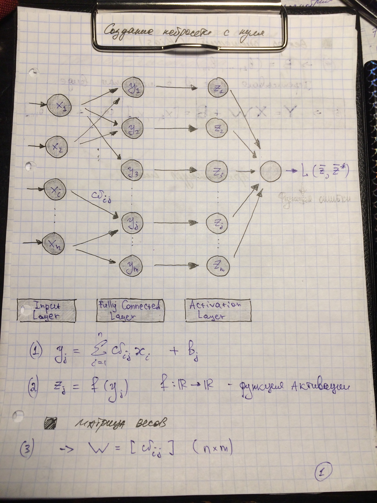
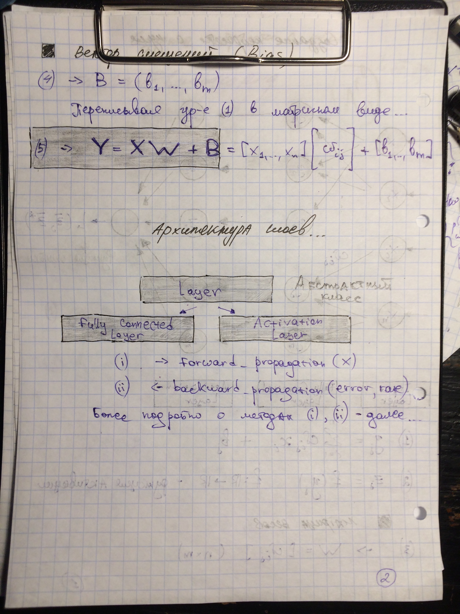
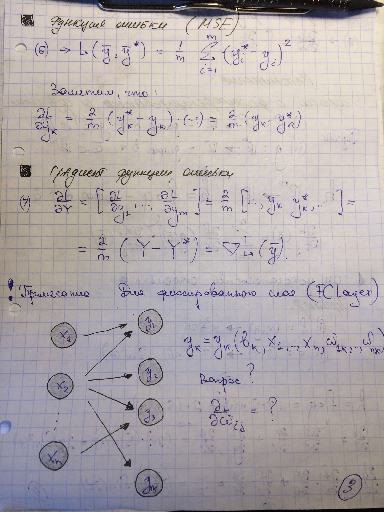
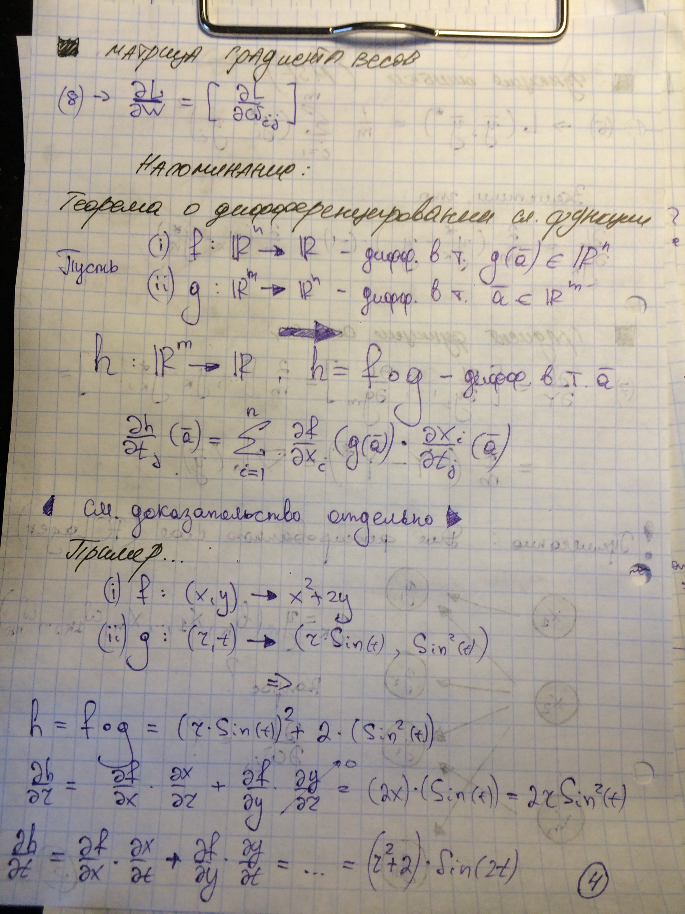

## Ниже представлена архитектура слоев и уравнение `(5)` для вычисления выходного слоя `FullyConnectedLayer`
 

## В качестве примера, в нашей нейросети будет использоваться функция ошибки `(6)` - среднеквадратичное отклонение

## Для нахождения производной по весовым коэффициентам можно применить теорему о дифференцировании сложной функции

