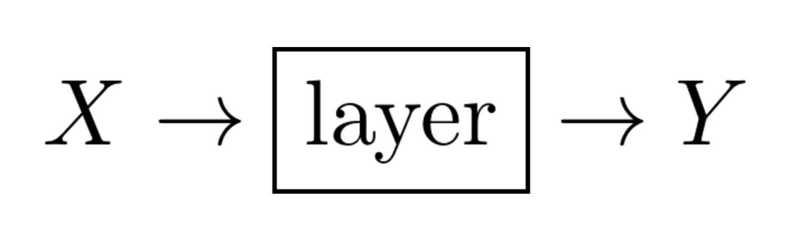
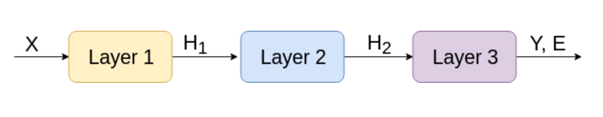
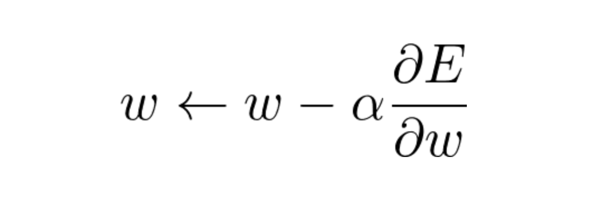
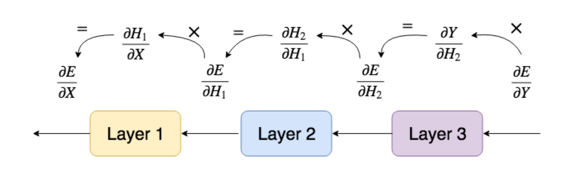

### Ниже представлена архитектура слоев и уравнение `(5)` для вычисления выходного слоя `FullyConnectedLayer`
 

Каждый слой (`FCLayer` или `ActivationLayer`) принимает входные данные - `X`, и выдает выход - `Y`.

Обратите внимание, что выход каждого слоя - является входом для другого, поэтому в целом процесс `Y = forward_propagation(X)`
выглядит следующим образом

### В качестве примера, в нашей нейросети будет использоваться функция ошибки `(6)` - среднеквадратичное отклонение

Как только входной вектор `X` прошел все трансформации слоев - на выходе имеем вектор `Y`,
от которого считаем функцию ошибки `(6)`, и начиная с этого момента нам нужно как-то обновить веса нейрости (параметры), чтобы 
минимизироват функцию ошибки. Здесь приходит на помощь...
### Метод градиентного спуска

Обратите внимание, что теперь процесс идет в обратную сторону: выход слоев стал входом, а входы, наоборот, выходами
`∇L(X) = backward_propagation(∇L(Y), α)`, см. ниже

### Применим теорему о дифференцированиии сложной функции...

