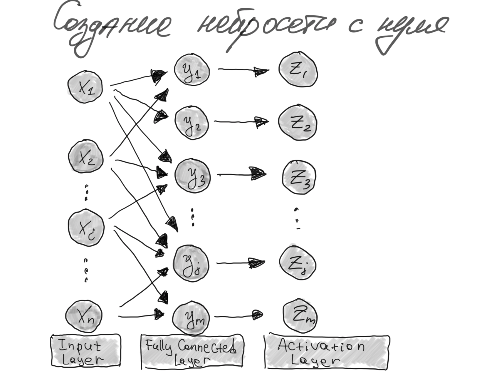
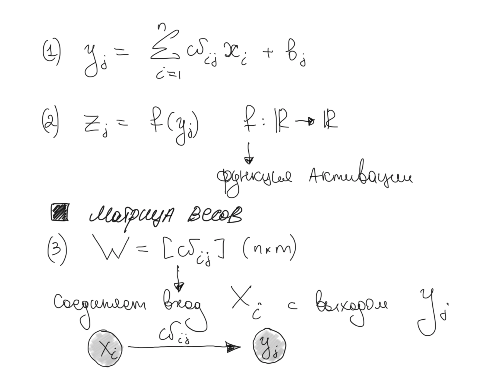

#### *`Y=forward_propagation(X)` для FullyConnected слоя*
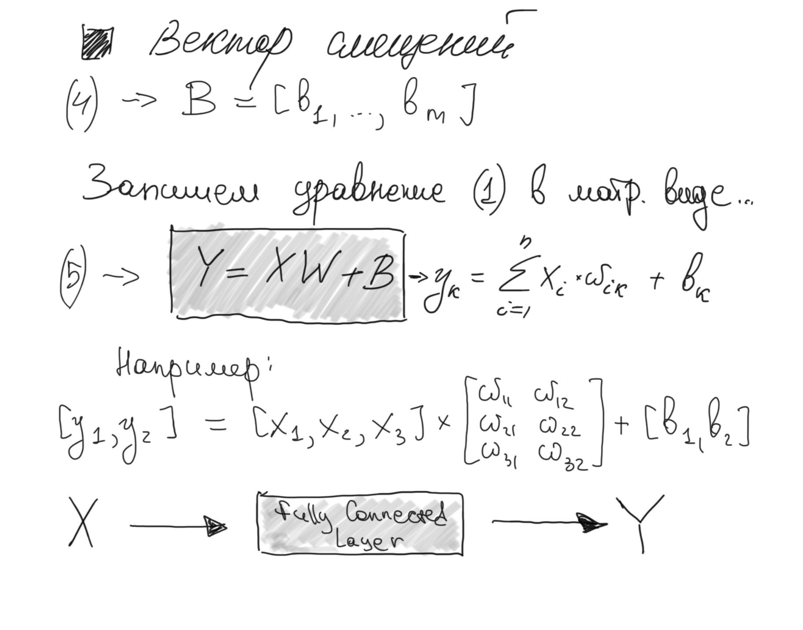

#### *Архитектура и функция ошибки*
Ниже представлена архитектура слоев и уравнение `(5)` для вычисления выходного слоя `FullyConnectedLayer`

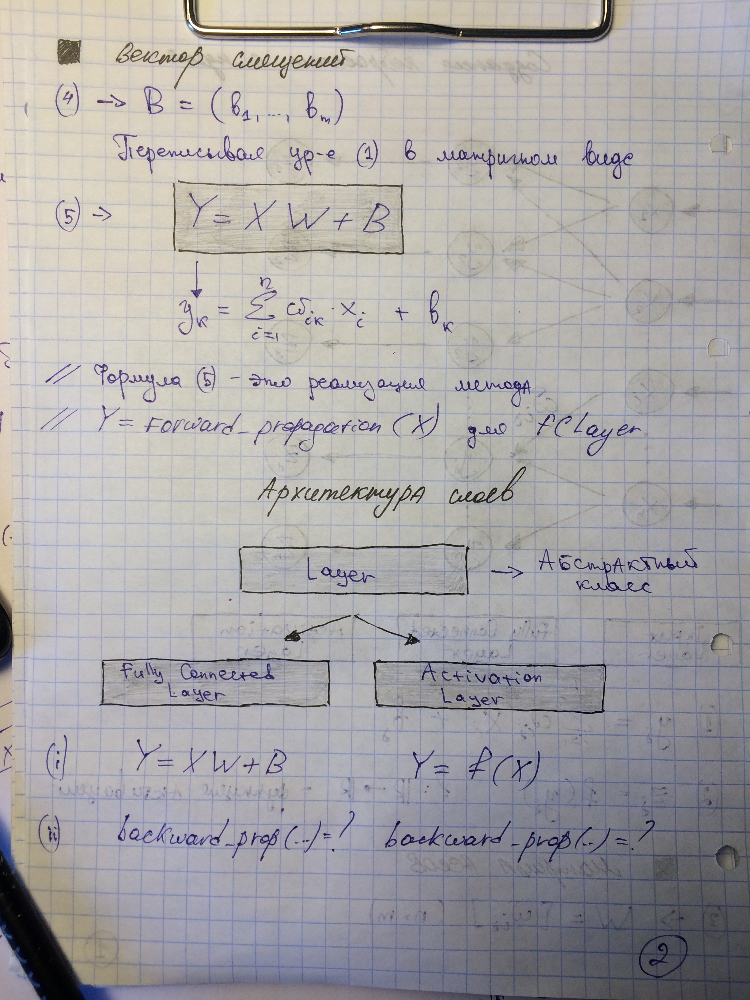

_Каждый слой (`FCLayer` или `ActivationLayer`) принимает входные данные - `X`, и выдает выход - `Y`._

_Обратите внимание, что выход каждого слоя - является входом для другого, поэтому в целом процесс `Y = forward_propagation(X)`
выглядит следующим образом_

_В коде это выглядит следующим образом._ 

Для `FCLayer`
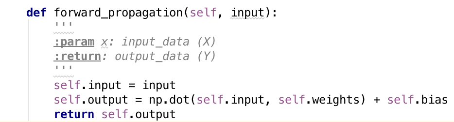

Для `ActivationLayer`
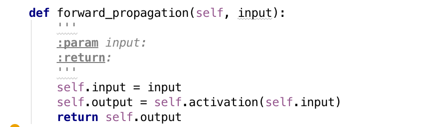

#### *MSE или среднеквадратичное отклонение*
_В качестве примера, в нашей нейросети будет использоваться функция ошибки `(6)` - среднеквадратичное отклонение_

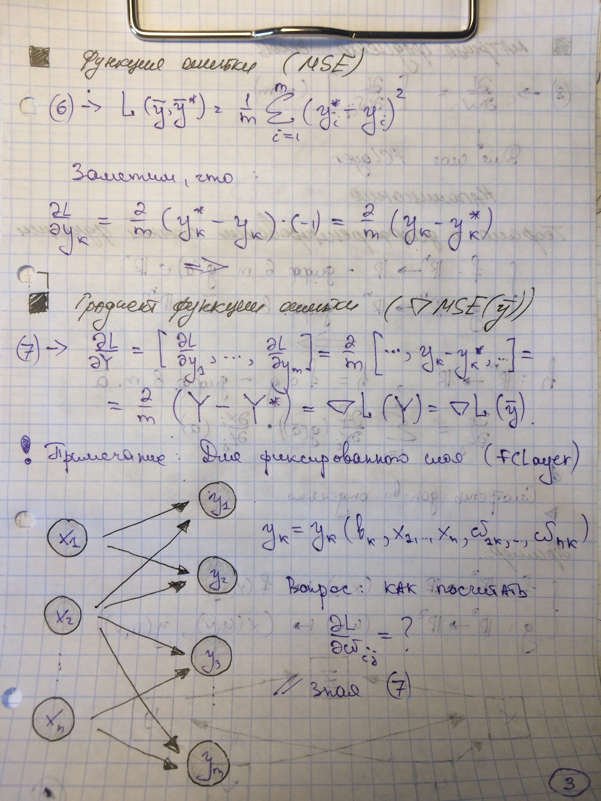

_Как только входной вектор `X` прошел все трансформации слоев - на выходе имеем вектор `Y`,
от которого считаем функцию ошибки `(6)`, и начиная с этого момента нам нужно как-то обновить веса нейрости (параметры), чтобы
минимизировать функцию ошибки. Здесь приходит на помощь..._
#### *Метод градиентного спуска*

Обратите внимание, что теперь процесс идет в обратную сторону: выход слоев стал входом, а входы, наоборот, выходами
`∇L(X) = backward_propagation(∇L(Y), α)`, см. ниже

#### *Применим теорему о дифференцированиии сложной функции...*

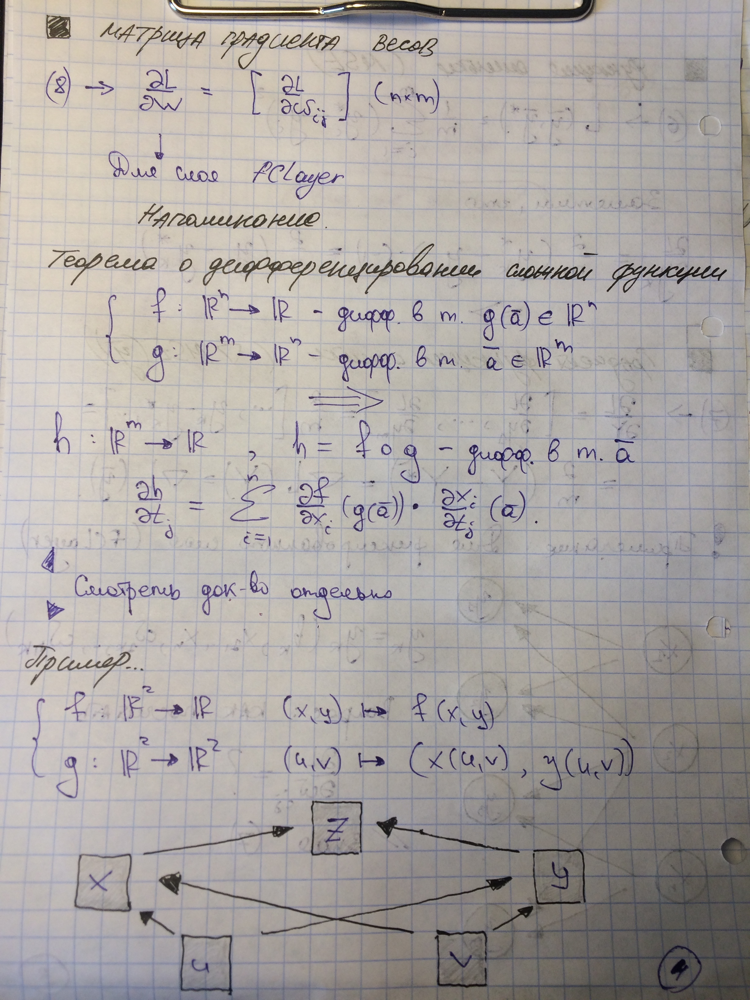

#### *Вывод формул обратного распространения ошибки для слоя `FCLayer`*

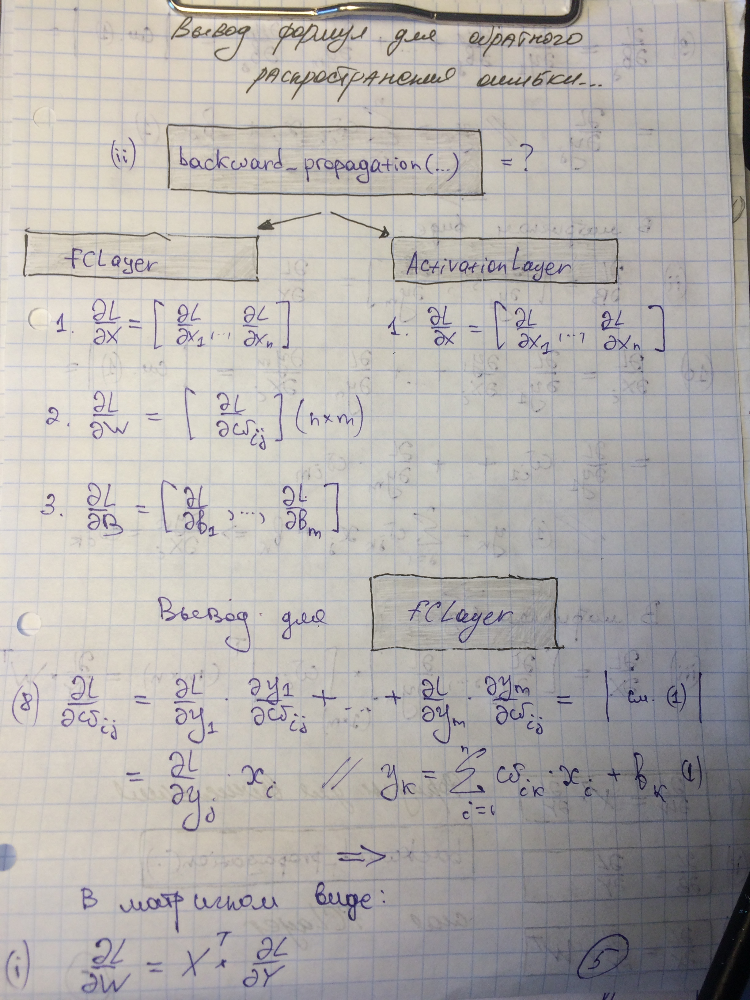

*Продолжение вывода на следующей странице*

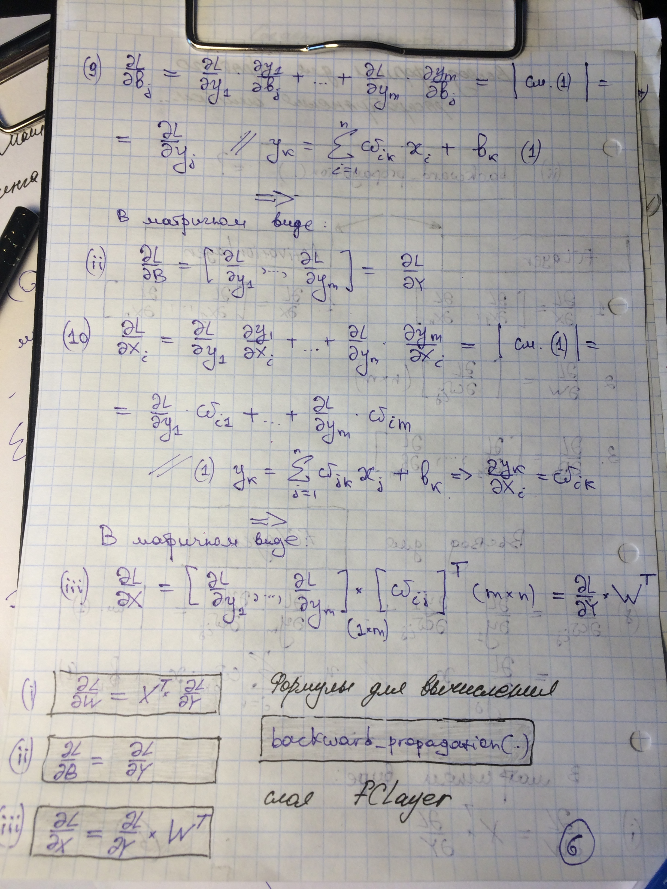

_Таким образом получаем итоговые формулые для реализации_ `backward_propagation()` слоя `FCLayer`
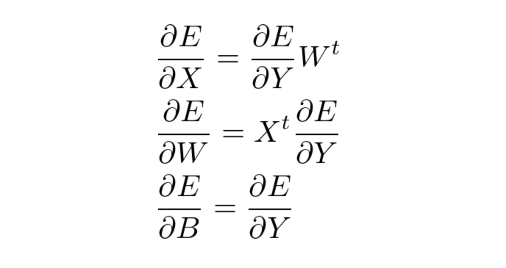

_Реализация в виде кода представленана ниже_
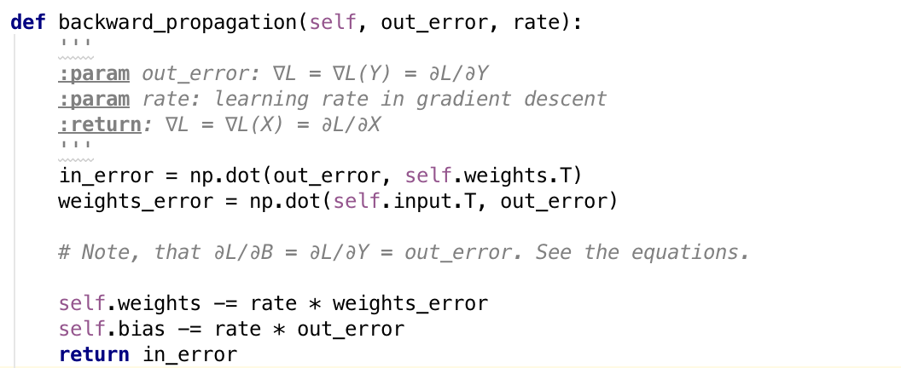

#### *Вывод формул обратного распространения ошибки для слоя `ActivationLayer`*

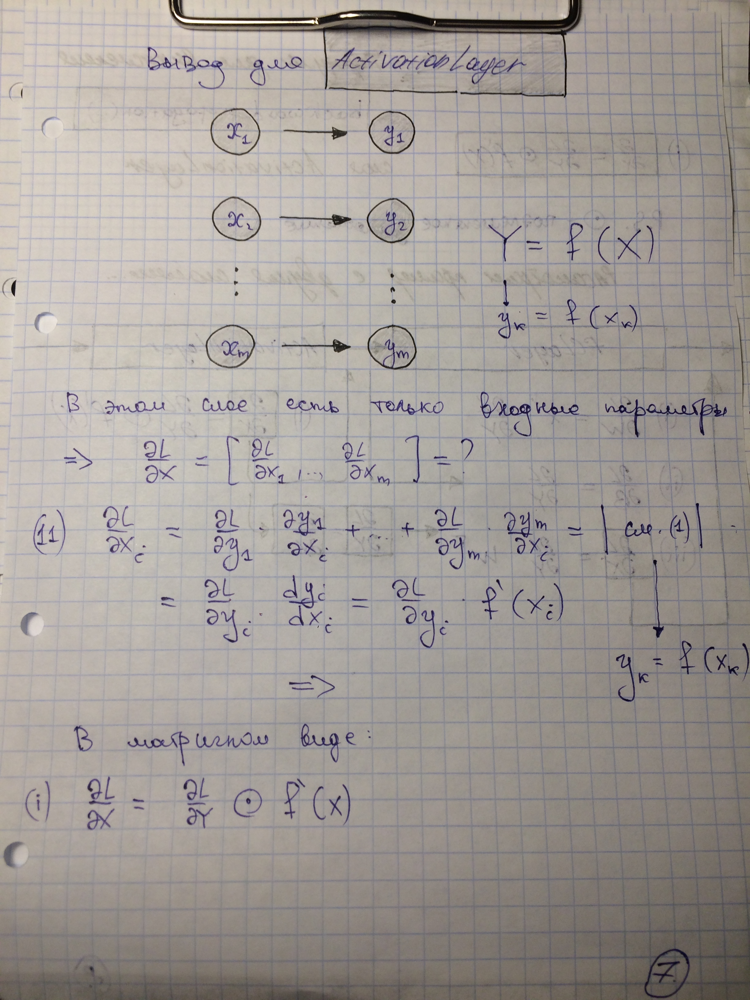

*Продолжение вывода на следующей странице*

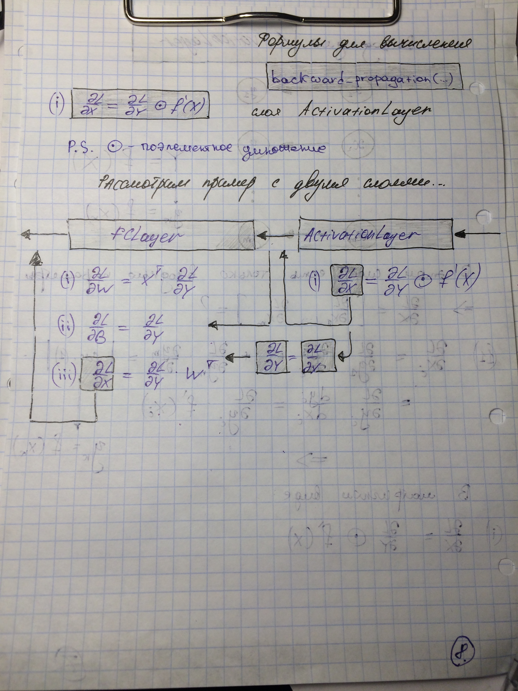

_Реализация в виде кода представлена ниже_
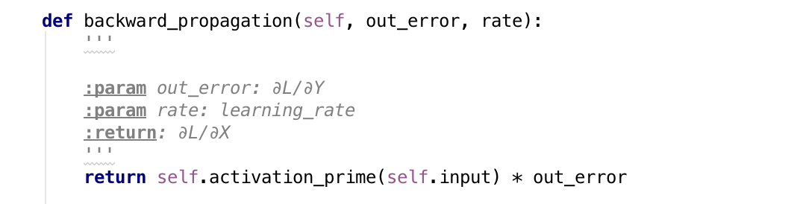

The end.