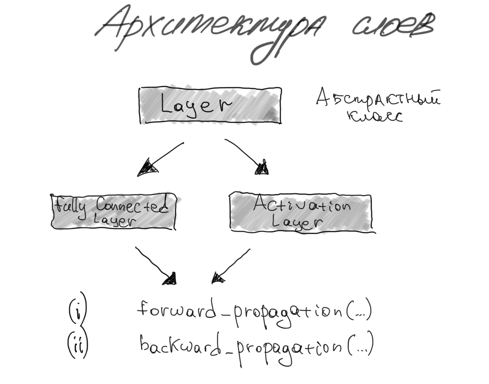
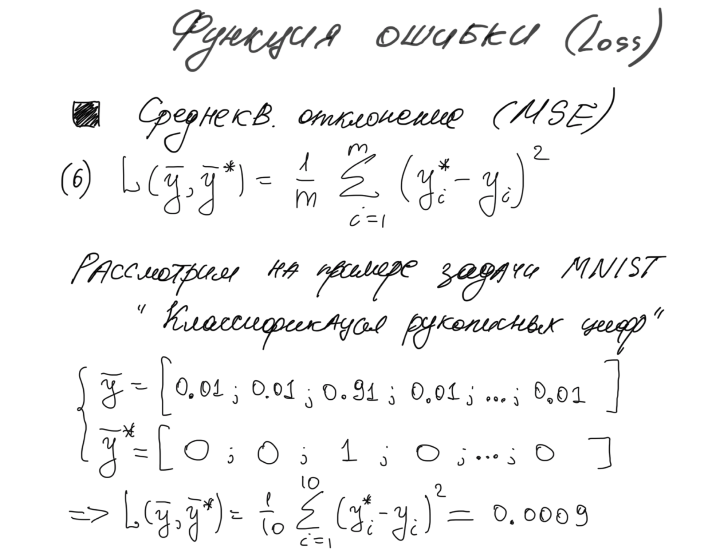
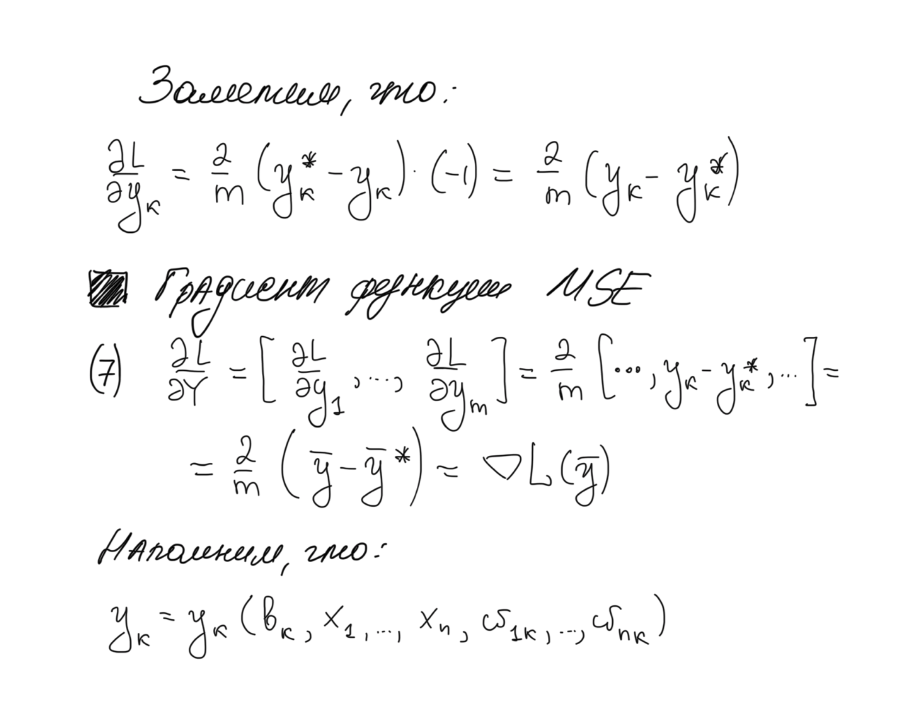
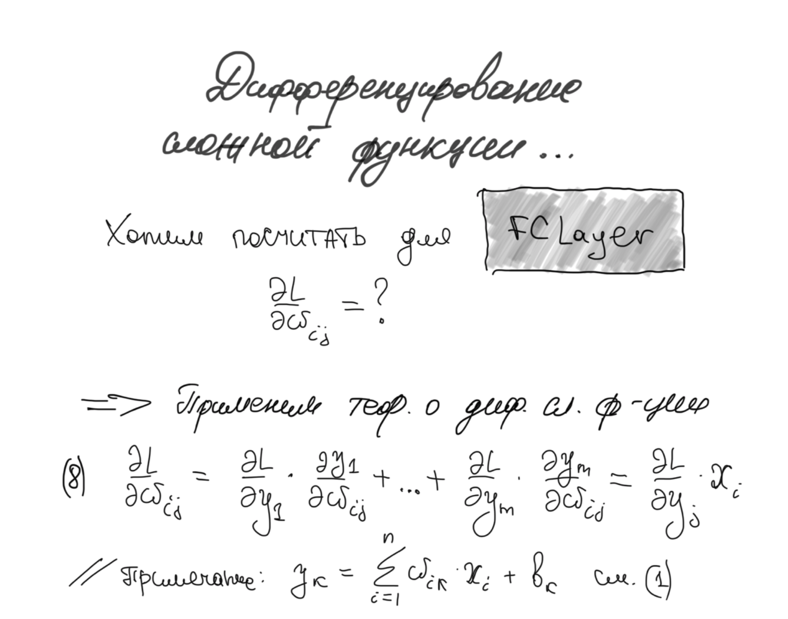
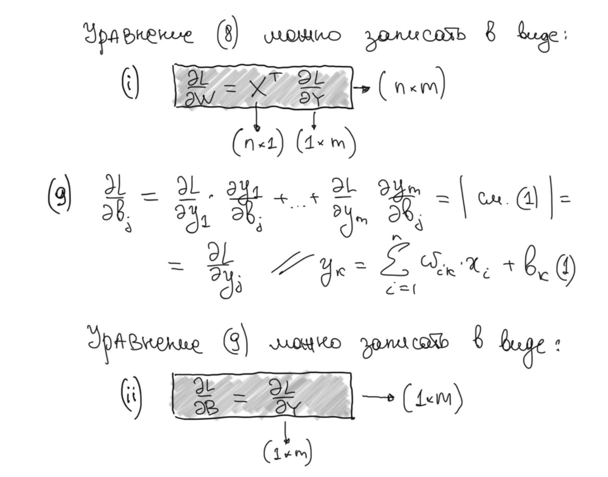
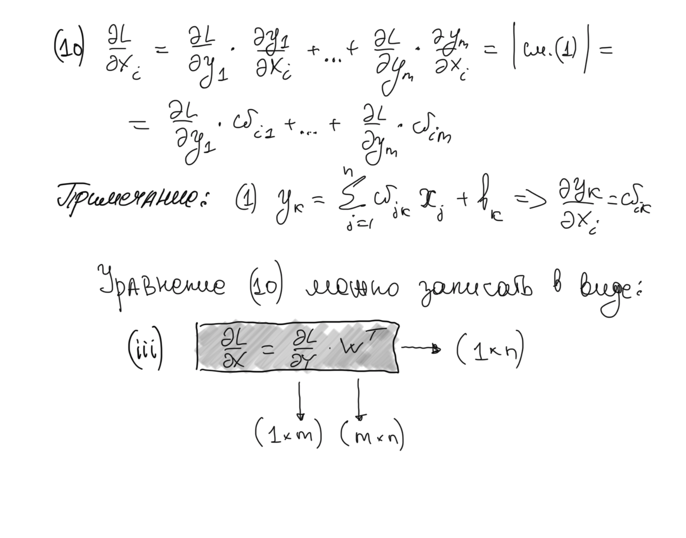
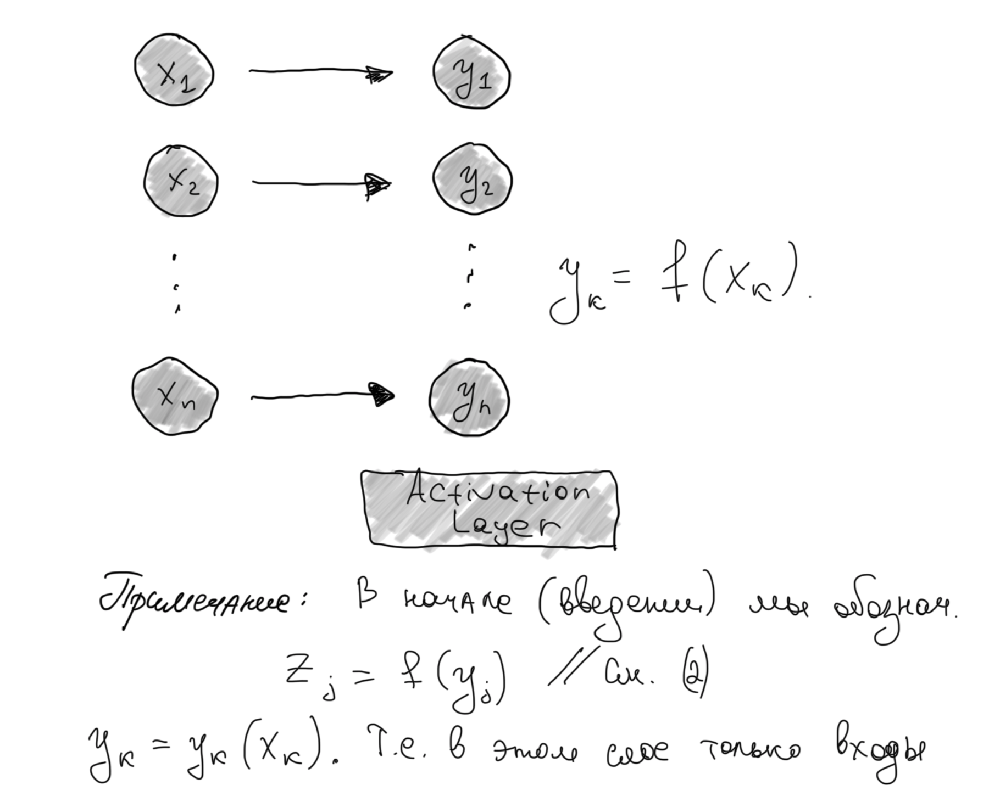
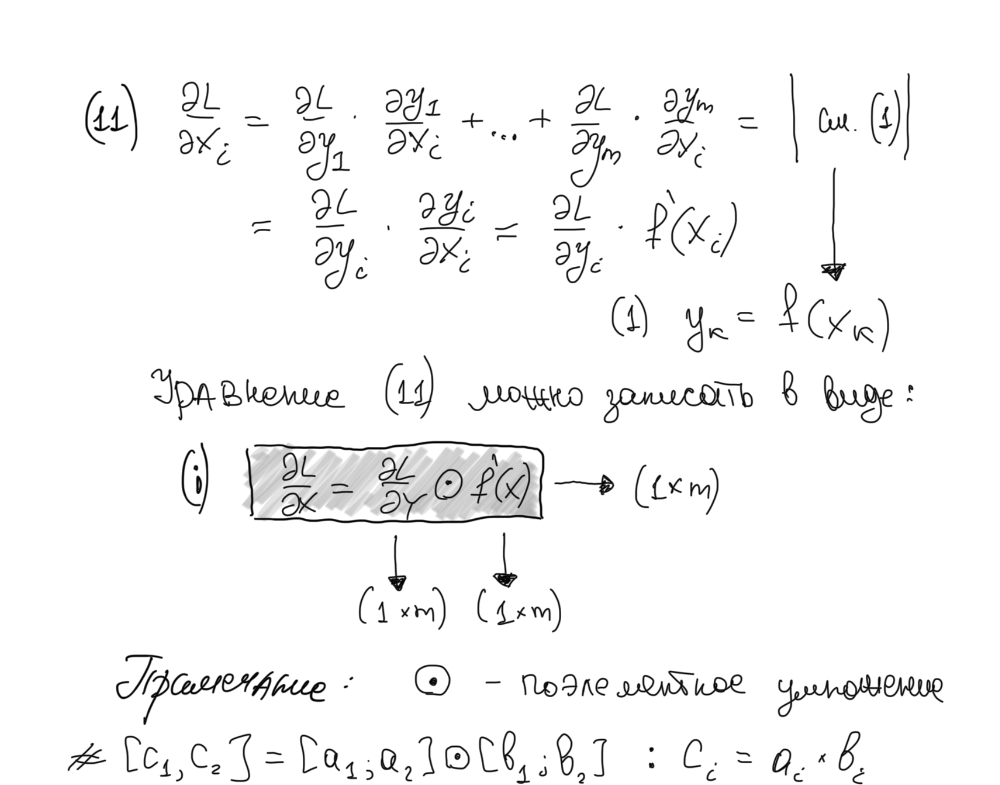
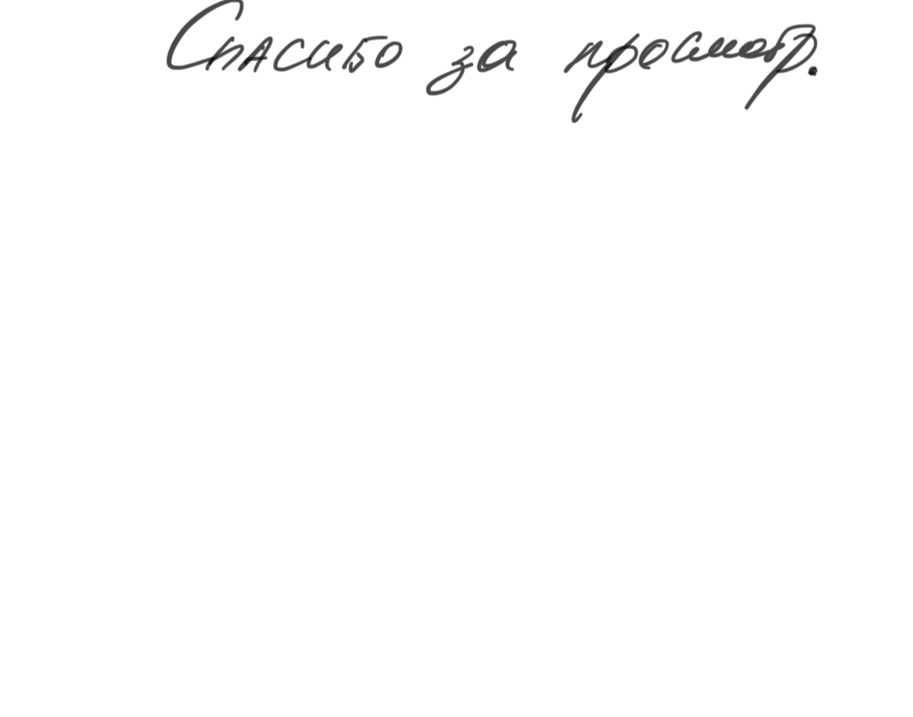

#### *`Y=forward_propagation(X)` для FullyConnected слоя*

#### *Архитектура слоев*

_Обратите внимание, что выход каждого слоя - является входом для другого, поэтому в целом процесс `Y = forward_propagation(X)`
выглядит следующим образом_

_В коде это выглядит следующим образом._ 

Для `FCLayer`

Для `ActivationLayer`

#### *MSE или среднеквадратичное отклонение*
_В качестве примера, в нашей нейросети будет использоваться функция ошибки `(6)` - среднеквадратичное отклонение_

_Как только входной вектор `X` прошел все трансформации слоев - на выходе имеем вектор `Y`,
от которого считаем функцию ошибки `(6)`, и начиная с этого момента нам нужно как-то обновить веса нейрости (параметры), чтобы
минимизировать функцию ошибки. Здесь приходит на помощь..._
#### *Метод градиентного спуска*

Обратите внимание, что теперь процесс идет в обратную сторону: выход слоев стал входом, а входы, наоборот, выходами
`∇L(X) = backward_propagation(∇L(Y), α)`, см. ниже

#### *Вывод формул обратного распространения ошибки для слоя `FCLayer`*

_Таким образом получаем итоговые формулые для реализации_ `backward_propagation()` слоя `FCLayer`

_Реализация в виде кода представленана ниже_

#### *Вывод формул обратного распространения ошибки для слоя `ActivationLayer`*

_Реализация в виде кода представлена ниже_

####*Связаться со мной:*
* [Vk](https://vk.com/mrtwistermrfreeman)
* [Twitter](https://twitter.com/IgorTarlinskii)
* [Facebook](https://www.facebook.com/igor.tarlinskii)
* [Telegram](@MrTwisterMrFreeman)